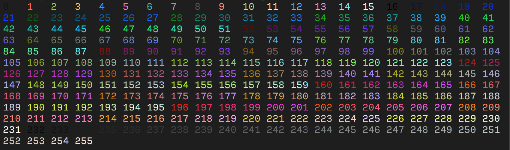

# Colours

## Implemented

See [`ANSI.md`](/imports/ANSI.md) in the `imports` folder

## ANSI Colour Chart

## Sources

[Print Documentation](https://github.com/bitburner-official/bitburner-src/blob/dev/markdown/bitburner.ns.print.md)

[ANSI escape codes](https://gist.github.com/fnky/458719343aabd01cfb17a3a4f7296797)
